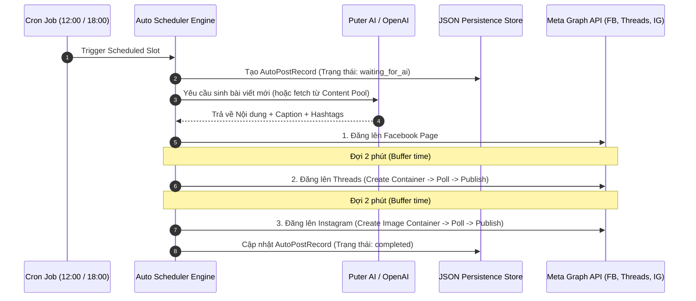

<div align="center">

# 🍇 AutoThreads

### **Nền tảng Tự động hóa Sáng tạo & Xuất bản Nội dung Đa Nền tảng**

*Tự động tạo nội dung bằng AI (Công thức Nước ép Sức khỏe hàng ngày) và tự động đăng tải lên Facebook, Threads & Instagram.*

[](https://nextjs.org/)
[](https://react.dev/)
[](https://www.typescriptlang.org/)
[](https://tailwindcss.com/)
[](https://bun.sh/)
[](https://developers.facebook.com/)
[](LICENSE)

</div>

---

## 📖 1. Giới thiệu Dự án

**AutoThreads** là giải pháp Social Media Automation toàn diện dành cho việc xây dựng và phát triển kênh nội dung tự động. Dự án tập trung vào chủ đề **"Công thức Nước ép Sức khỏe Mỗi ngày dành cho Phụ nữ Việt Nam"**, tự động tạo bài viết hấp dẫn chuẩn Copywriting bằng AI và xuất bản đồng bộ lên **Facebook Page**, **Threads**, và **Instagram Business**.

Dự án được xây dựng trên nền tảng **Next.js 16 (App Router)** tiên tiến, tối ưu hóa hiệu năng với runtime **Bun**, áp dụng các chuẩn thiết kế kiến trúc chuẩn mực (Singleton Pattern, Global Guard Pattern) cùng khả năng xử lý bài viết theo chuỗi an toàn chống dính Spam rate-limit từ Meta Graph API.

---

## ✨ 2. Tính năng Nổi bật

- 🤖 **AI Content Engine Đa Nguồn**:
  - Tích hợp mặc định **Puter AI (Puter.js)** hoàn toàn miễn phí, chạy được cả ở Client-side và Server-side.
  - Hỗ trợ linh hoạt chuyển đổi hoặc fallback sang **OpenAI (GPT-4o-mini)** và **Google Gemini**.
  - Hệ thống Prompt Engineering chuyên sâu về chủ đề chăm sóc sức khỏe, nước ép làm đẹp da, giữ dáng cho phái đẹp.

- ⏱️ **Hệ thống Auto 3-Platform Scheduler**:
  - Tự động lập lịch đăng bài vào 2 khung giờ vàng hàng ngày: **12:00 (Trưa)** và **18:00 (Tối)**.
  - Luồng đăng 2 pha (2-phase execution pipeline): Khởi tạo trạng thái đăng → Chờ AI sinh nội dung/Lấy từ kho → Xuất bản lên các nền tảng.
  - Tự động hoãn giãn cách 2 phút giữa các nền tảng (**FB → (2 min) → Threads → (2 min) → IG**) để đảm bảo tính ổn định API.

- 📦 **Content Pool & Nhập liệu Excel (XLSX)**:
  - Quản lý kho bài viết soạn sẵn chuyên nghiệp.
  - Hỗ trợ Import bài viết hàng loạt từ file Excel (`.xlsx`) phục vụ chiến dịch Marketing dài hạn.
  - Lựa chọn linh hoạt giữa việc sinh bài viết mới từ AI hoặc ưu tiên lấy bài viết từ Content Pool.

- 📊 **Dashboard & Tracking Metrics**:
  - Giao diện quản trị hiện đại theo dõi trạng thái lịch đăng, lịch sử đăng bài chi tiết.
  - Thống kê chỉ số tương tác (Likes, Views, Comments, Shares) trực tiếp qua Meta Graph API.
  - Giám sát trạng thái tài khoản và cảnh báo thời hạn **Access Token Meta**.

- ⚙️ **Bộ công cụ CLI Shell Scripts tiện ích**:
  - Đi kèm bộ Shell Scripts hỗ trợ OAuth login, lấy & làm mới Long-Lived Access Token tự động cho Facebook, Instagram và Threads.

---

## 🏗️ 3. Kiến trúc Kỹ thuật & Luồng Hoạt động

### 🔄 Luồng Tự động Đăng bài (Auto Post Flow)



### 🧩 Core Design Patterns

1. **Singleton Service Pattern**: 
   - Các service giao tiếp với Meta Graph API (`ThreadsService`, `FacebookService`, `InstagramService`) được đóng gói dạng Singleton class giúp tái sử dụng kết nối và quản lý cấu hình tập trung.
2. **Global Guard Pattern**:
   - Sử dụng cơ chế `global.__schedulerStarted` để ngăn chặn việc Next.js khởi tạo trùng lặp Cron Scheduler khi reload hoặc chạy Hot Module Replacement (HMR) ở môi trường Development.
3. **Container-Polling Strategy**:
   - Xử lý việc upload media/text trên Threads và Instagram theo đúng quy chuẩn 2 bước của Meta: Tạo Media Container → Polling trạng thái cho đến khi `FINISHED` → Kích hoạt xuất bản (`publish`).

---

## 💻 4. Công nghệ Sử dụng

| Phân loại | Công nghệ / Thư viện | Mô tả |
| :--- | :--- | :--- |
| **Frontend Framework** | [Next.js 16.1.6](https://nextjs.org/) (App Router) | Server Components, API Routes, App Shell Layout |
| **UI & Styling** | [React 19](https://react.dev/), [Tailwind CSS v4](https://tailwindcss.com/) | Giao diện Dark/Light Mode hiện đại, Lucide Icons |
| **Runtime & PM** | [Bun](https://bun.sh/) | Package manager và JS Runtime tốc độ cao |
| **Language** | [TypeScript 5](https://www.typescriptlang.org/) | Strict mode, Type safety cho toàn bộ DTO & Service |
| **AI Providers** | Puter.js, OpenAI SDK, `@google/genai` | Tự động hóa sinh bài viết đa dạng chủ đề nước ép |
| **Social APIs** | Meta Graph API v25.0, Threads API v1.0 | RESTful API làm việc với FB, IG & Threads |
| **Task Scheduling** | `node-cron`, Next.js Instrumentation | Lập lịch Cron tự động khởi chạy cùng Server |
| **Data Storage** | Native JSON Files (`/data`) / `@vercel/kv` | Lưu trữ dữ liệu mượt mà, dễ dàng bảo trì |
| **Data Import** | `xlsx` (SheetJS) | Đọc và xử lý dữ liệu bài viết hàng loạt từ Excel |

---

## 📁 5. Cấu trúc Dự án

```text
autothreads/
├── app/                        # Next.js App Router
│   ├── api/                    # RESTful API Endpoints
│   │   ├── accounts/           # Quản lý tài khoản mạng xã hội
│   │   ├── ai-config/          # Cấu hình AI Provider (Puter/OpenAI/Gemini)
│   │   ├── auth/threads/       # OAuth authentication cho Threads
│   │   ├── auto-scheduler/     # API điều khiển Auto Scheduler 3 nền tảng
│   │   ├── content-pool/       # Quản lý kho bài viết & Import XLSX
│   │   ├── cron/               # Endpoints kích hoạt bởi Vercel Cron / External Cron
│   │   ├── history/            # Lịch sử bài viết & thống kê
│   │   ├── platforms/          # API riêng biệt cho FB, IG, Threads
│   │   └── puter-prompt/       # Trigger sinh bài viết client-side với Puter.js
│   ├── platforms/              # UI Pages theo từng nền tảng (FB, IG, Threads)
│   ├── layout.tsx              # Root Layout ứng dụng
│   └── page.tsx                # Main Dashboard View
├── components/                 # React UI Components
│   ├── dashboard/              # Widgets, Post Cards, Form soạn thảo, Schedule Grid
│   ├── layout/                 # Header, Sidebar Nav, Platform Shell
│   ├── platforms/              # Các UI Tab riêng cho FB, IG, Threads
│   ├── shared/                 # AI Config Card, Platform Monitor Widgets
│   └── ui/                     # Common UI components (Icons, Spinners, Stats)
├── lib/                        # Core Business Logic & Services
│   ├── ai/                     # AI Providers Abstraction Layer (Puter, Gemini, OpenAI)
│   ├── prompts/                # Templates Prompt tiếng Việt chuyên sâu cho Nước ép
│   ├── services/               # Meta API Singletons (Threads, FB, IG, Schedulers)
│   ├── content-pool.ts         # Quản lý Content Pool
│   └── scheduler.ts            # Standalone Threads Scheduler Engine
├── data/                       # Thư mục lưu trữ dữ liệu JSON (Local Storage)
│   ├── ai-config.json
│   ├── auto-post-history.json
│   ├── fb-post-history.json
│   └── ig-post-history.json
├── docs/                       # Tài liệu thiết kế kiến trúc & quy chuẩn domain
├── types/                      # TypeScript definitions & interfaces
├── instrumentation.ts          # Khởi chạy Scheduler khi khởi động Server
├── check-fb-token.sh           # CLI Tool kiểm tra thời hạn Access Token FB
├── refresh-all-tokens.sh       # CLI Tool làm mới Access Token hàng loạt
└── package.json
```

---

## 🔌 6. Danh sách API Endpoints

### 🔐 OAuth & Quản lý Tài khoản
| HTTP Method | Endpoint | Yêu cầu Auth | Chức năng |
| :--- | :--- | :---: | :--- |
| `GET` | `/api/accounts` | ❌ | Trả về danh sách & trạng thái kết nối các tài khoản Meta |
| `PATCH` | `/api/accounts` | ❌ | Cập nhật cấu hình/token của tài khoản |
| `GET` | `/api/auth/threads` | ❌ | Khởi tạo OAuth Flow với Threads API |
| `POST` | `/api/auth/threads` | ❌ | Xử lý Exchange Authorization Code lấy Long-Lived Token |

### 🤖 AI Engine & Content Generation
| HTTP Method | Endpoint | Yêu cầu Auth | Chức năng |
| :--- | :--- | :---: | :--- |
| `GET` | `/api/ai-config` | ❌ | Lấy cấu hình AI Provider hiện tại |
| `POST` | `/api/ai-config` | ❌ | Cập nhật AI Provider (Puter / OpenAI / Gemini) & Model |
| `POST` | `/api/puter-prompt` | ❌ | Kích hoạt AI sinh nội dung công thức nước ép theo chủ đề |

### ⏱️ Auto-Scheduler & Cron Automation
| HTTP Method | Endpoint | Yêu cầu Auth | Chức năng |
| :--- | :--- | :---: | :--- |
| `GET` | `/api/auto-scheduler` | ❌ | Lấy trạng thái Auto Scheduler (3 nền tảng) & danh sách slot |
| `POST` | `/api/auto-scheduler` | ❌ | Bật/tắt Auto Scheduler hoặc đăng ngay bài viết mới |
| `PATCH` | `/api/auto-scheduler` | ❌ | Cập nhật trạng thái bài đăng trong hàng chờ |
| `PUT` | `/api/auto-scheduler` | ❌ | Cập nhật cấu hình khung giờ đăng bài |
| `GET` | `/api/cron/auto` | 🔑 `CRON_SECRET` | Endpoint Cron trigger tự động đăng 3 nền tảng |
| `GET` | `/api/cron/scheduled` | 🔑 `CRON_SECRET` | Endpoint Cron trigger cho lịch Threads-only |

### 📦 Content Pool & Import
| HTTP Method | Endpoint | Yêu cầu Auth | Chức năng |
| :--- | :--- | :---: | :--- |
| `GET` | `/api/content-pool` | ❌ | Lấy danh sách bài viết trong kho |
| `PATCH` | `/api/content-pool` | ❌ | Cập nhật bài viết trong Content Pool |
| `DELETE` | `/api/content-pool` | ❌ | Xóa bài viết khỏi Content Pool |
| `POST` | `/api/content-pool/import-xlsx` | ❌ | Import dữ liệu bài viết từ file Excel (.xlsx) |

### 📱 Platform-Specific & Analytics History
| HTTP Method | Endpoint | Yêu cầu Auth | Chức năng |
| :--- | :--- | :---: | :--- |
| `GET` | `/api/platforms/facebook` | ❌ | Lấy danh sách bài viết & Insights Facebook Page |
| `GET` | `/api/platforms/instagram` | ❌ | Lấy bài viết & Insights Instagram Business |
| `GET` | `/api/threads/recent` | ❌ | Lấy danh sách bài viết gần đây trên Threads |
| `GET` | `/api/history` | ❌ | Trả về tổng hợp lịch sử đăng bài trên cả 3 nền tảng |

---

## 🚀 7. Hướng dẫn Cài đặt & Khởi chạy

### 📋 Yêu cầu Tiền đề (Prerequisites)
- [Bun](https://bun.sh/) (Phiên bản `>= 1.0.0`) hoặc [Node.js](https://nodejs.org/) (`>= 20.0.0`)
- Tài khoản Meta Developer App với quyền truy cập Threads Graph API, Facebook Graph API & Instagram Graph API.

### 🛠️ Các bước Cài đặt

1. **Clone repository về máy local:**
   ```bash
   git clone https://github.com/huuphat26/AutoThreads.git
   cd AutoThreads
   ```

2. **Cài đặt các thư viện phụ thuộc (Dependencies):**
   ```bash
   bun install
   ```

3. **Cấu hình Biến môi trường (`.env`):**
   Tạo file `.env` từ file mẫu `.env.example`:
   ```bash
   cp .env.example .env
   ```

   Điền các thông số quan trọng vào file `.env`:
   ```env
   # Section 1: Meta Access Tokens
   THREADS_APP_ID=your_threads_app_id
   THREADS_APP_SECRET=your_threads_app_secret
   THREADS_ACCESS_TOKEN=your_long_lived_access_token

   FB_PAGE_ACCESS_TOKEN=your_fb_page_access_token
   FB_PAGE_ID=your_fb_page_id

   IG_ACCESS_TOKEN=your_ig_access_token
   IG_USER_ID=your_ig_user_id

   # Section 2: AI Config (Optional)
   OPENAI_API_KEY=your_openai_key
   OPENAI_MODEL=gpt-4o-mini

   # Section 3: Scheduler Config
   TIMEZONE=Asia/Ho_Chi_Minh
   AUTO_SCHEDULER_ENABLED=true
   CRON_SECRET=your_custom_cron_secret
   ```

4. **Khởi động ứng dụng ở chế độ Development:**
   ```bash
   bun run dev
   ```
   Mở trình duyệt và truy cập địa chỉ: `http://localhost:3000`

---

## 🛠️ 8. Bộ Công cụ CLI Utility Scripts

Dự án đi kèm các Script Shell tiện lợi trong thư mục gốc giúp quản lý token Meta dễ dàng:

```bash
# Kiểm tra thời hạn & tính hợp lệ của Facebook Access Token
./check-fb-token.sh

# Lấy Auth URL cho Threads / FB / IG
./get-auth-url.sh
./get-fb-auth-url.sh
./get-ig-auth-url.sh

# Đổi Authorization Code lấy Long-Lived Token
./get-token.sh
./get-fb-token.sh
./get-ig-token.sh

# Tự động làm mới toàn bộ Access Token trên hệ thống
./refresh-all-tokens.sh
```

---

## 📜 9. Danh sách Lệnh (Commands)

| Lệnh | Mô tả |
| :--- | :--- |
| `bun run dev` | Khởi chạy Dev Server tại `http://localhost:3000` |
| `bun run build` | Biên dịch ứng dụng cho Production |
| `bun run start` | Chạy ứng dụng Production đã biên dịch |
| `bun run lint` | Kiểm tra cú pháp & mã nguồn với ESLint |
| `bunx tsc --noEmit` | Kiểm tra lỗi Type trong toàn bộ dự án TypeScript |

---

## 📚 10. Tài liệu Liên quan

- 📖 [AGENTS.md](./AGENTS.md) - Quy chuẩn coding & hướng dẫn dành cho AI Agents.
- 🏗️ [Architecture Documentation](./docs/architecture.md) - Chi tiết thiết kế kiến trúc hệ thống.
- 📐 [Domain Rules](./docs/domain-rules.md) - Các quy tắc nghiệp vụ và giới hạn API Meta.
- 🔄 [Auto Post Flow](./docs/auto-post-flow.md) - Sơ đồ chi tiết luồng tự động sinh nội dung và xuất bản.

---

<div align="center">

⭐ **AutoThreads** - Sáng tạo nội dung thông minh & Tự động hóa Social Media mạnh mẽ ⭐

*Phát triển bởi Developer dành cho Developers!*

</div>
